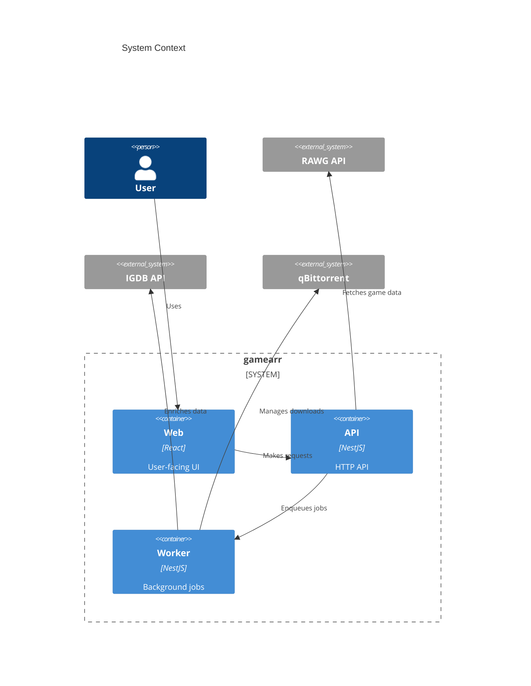
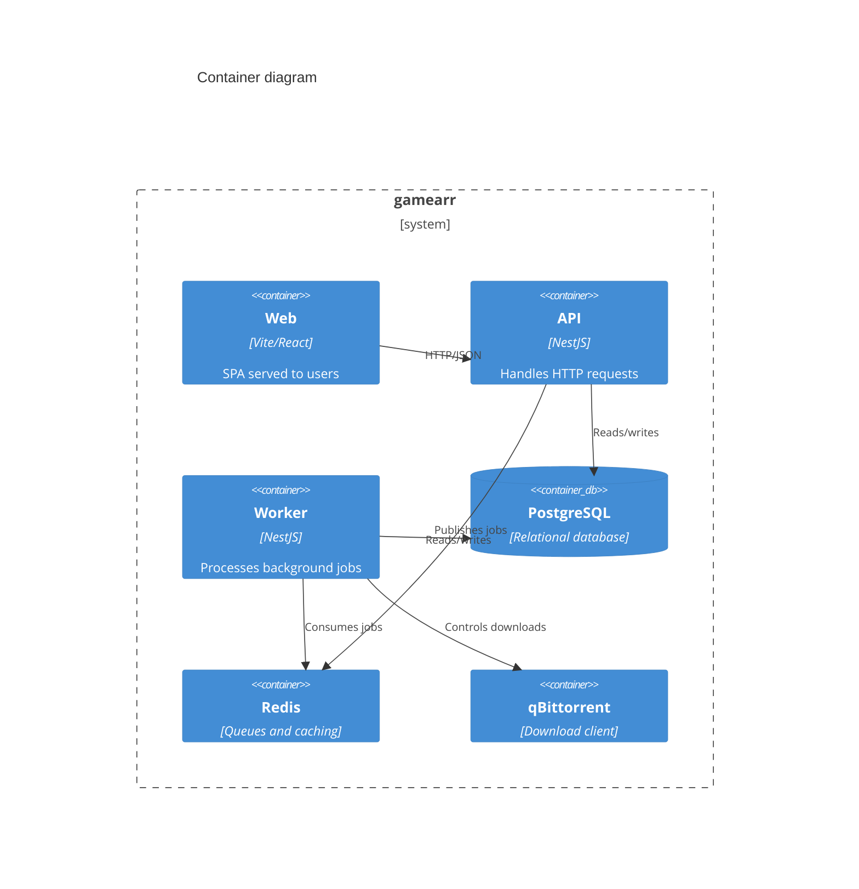
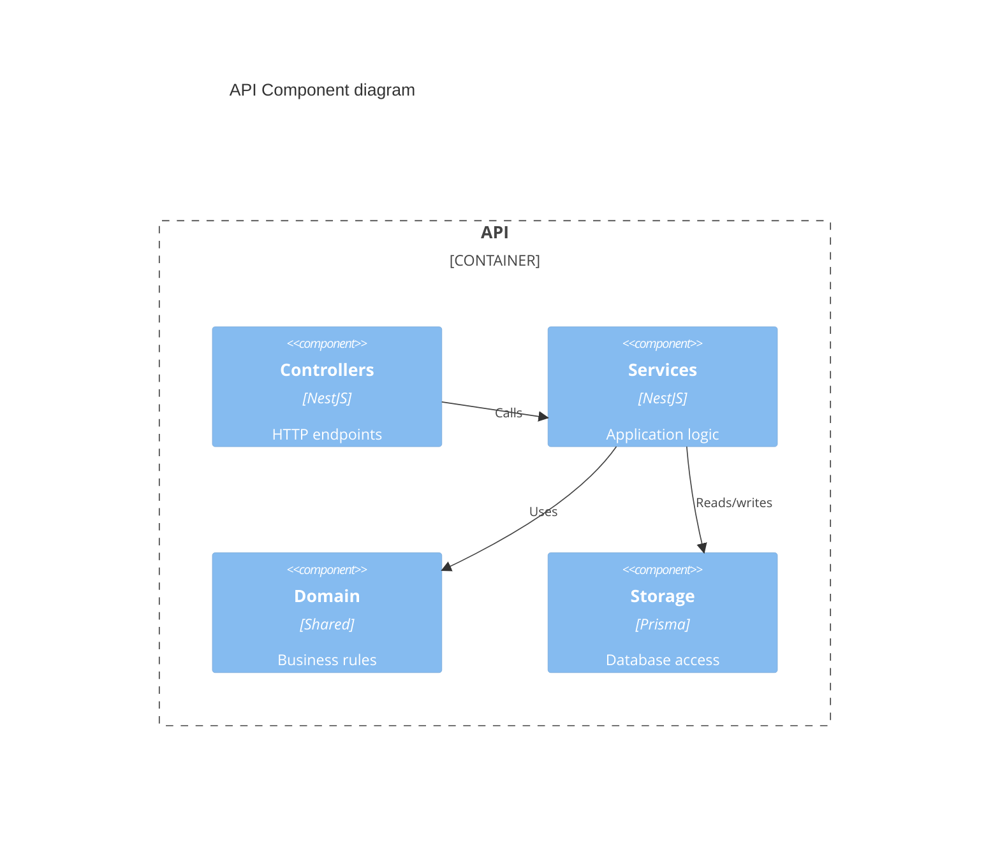

# Architecture

This document outlines the gamearr system using the [C4 model](https://c4model.com/).

## Context

```mermaid
C4Context
title System Context
Person(user, "User")
System_Boundary(gamearr, "gamearr") {
  Container(web, "Web", "React", "User-facing UI")
  Container(api, "API", "NestJS", "HTTP API")
  Container(worker, "Worker", "NestJS", "Background jobs")
}
System_Ext(rawg, "RAWG API")
System_Ext(igdb, "IGDB API")
System_Ext(qbt, "qBittorrent")
Rel(user, web, "Uses")
Rel(web, api, "Makes requests")
Rel(api, worker, "Enqueues jobs")
Rel(api, rawg, "Fetches game data")
Rel(worker, igdb, "Enriches data")
Rel(worker, qbt, "Manages downloads")
```

## Container

```mermaid
C4Container
title Container diagram
Boundary(gamearr, "gamearr") {
  Container(web, "Web", "Vite/React", "SPA served to users")
  Container(api, "API", "NestJS", "Handles HTTP requests")
  Container(worker, "Worker", "NestJS", "Processes background jobs")
  ContainerDb(db, "PostgreSQL", "Relational database")
  Container(redis, "Redis", "Queues and caching")
  Container(qbt, "qBittorrent", "Download client")
}
Rel(web, api, "HTTP/JSON")
Rel(api, db, "Reads/writes")
Rel(api, redis, "Publishes jobs")
Rel(worker, redis, "Consumes jobs")
Rel(worker, db, "Reads/writes")
Rel(worker, qbt, "Controls downloads")
```

## Component

```mermaid
C4Component
title API Component diagram
Container_Boundary(api, "API") {
  Component(controller, "Controllers", "NestJS", "HTTP endpoints")
  Component(service, "Services", "NestJS", "Application logic")
  Component(domain, "Domain", "Shared", "Business rules")
  Component(storage, "Storage", "Prisma", "Database access")
}
Rel(controller, service, "Calls")
Rel(service, domain, "Uses")
Rel(service, storage, "Reads/writes")
```
